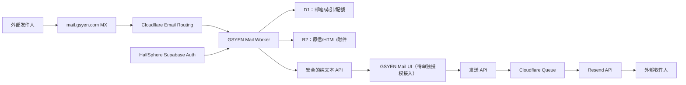

# GSYEN 邮箱完整方案

更新日期：2026-07-29

## 结论

推荐采用“GSYEN 应用邮箱 + 可插拔外部邮箱连接器”的双层架构：

1. 第一层现在实现：用户通过现有 HalfSphere / Supabase 身份申请
   `name@mail.gsyen.com`，在 GSYEN 内收发邮件。
2. 第二层以后实现：用户授权连接 Gmail 或 Outlook，把已有邮箱纳入
   GSYEN 归纳与搜索。
3. 如果未来要求 Thunderbird、Apple Mail、Outlook 原生登录，再引入
   Stalwart 作为 IMAP/JMAP/SMTP 邮箱核心；当前不自建公网 SMTP。

这个选择不会改变 `gsyen.com` 根域现有 Google MX，避免 Ethan 当前邮箱
停收。邮件子域拥有独立 MX，可以单独迁移或替换供应商。

## 为什么需要数据库

邮件不是一次 HTTP 请求即可完成的功能。数据库用于：

- 邮箱地址与 HalfSphere 用户 ID 的唯一映射；
- 收件箱、发件箱、投递状态和会话引用；
- `Message-ID` 去重，避免邮件路由重试产生重复邮件；
- 注册审批、停用和滥用处置；
- 每日发送配额、审计记录和故障追踪。

HalfSphere 会员库只回答“用户是谁、等级是什么”。邮件正文、附件和原始
MIME 不进入会员库，防止会员数据与私人通信混在一起。

## 数据流

## 用户能否注册

可以，后端已经实现注册流程：

1. 用户先完成现有 GSYEN / HalfSphere 登录和邮箱验证。
2. 用户申请唯一的 `localPart`。
3. 系统保留敏感地址，如 `admin`、`postmaster`、`security`、`support`。
4. 新地址默认是 `pending`，避免机器人批量注册后发垃圾邮件。
5. Supabase `app_metadata.mail_admin=true` 的管理员激活邮箱。
6. 激活后才可以收件和发件，默认每日最多 30 封、每封最多 10 个收件人。

公测阶段建议“邀请制 + 人工激活”。当退信、投诉、风控和付费配额完善后，
再逐步自动审批，不建议第一天就完全开放。

## 安全设计

- 邮件正文一律视为不可信数据，不得成为 AI 系统指令。
- 首期 AI 可以摘要、分类、提出回复草稿，但不得自动发送。
- HTML 原文隔离存入 R2；API 首期只返回纯文本，避免存储型 XSS。
- 原始 MIME 先检查大小再解析；最大 5 MiB，附件最多 32 个。
- 地址、显示名和回复头禁止 CR/LF，阻断邮件头注入。
- Bearer Token 仅在 Worker 内交给 Supabase Auth 验证。
- 发件经队列处理；永久错误停止重试，临时错误有限重试并进入 DLQ。
- 每个邮箱、Message-ID 和对象路径均使用服务端生成的标识。
- 所有管理员操作和发件入队均有审计记录。

## 市面方案对比

以下是“适合 GSYEN 当前阶段”的工程判断，不是通用排名。

| 方案 | 收件 | 发件 | 完整 IMAP 邮箱 | GSYEN 适配 | 判断 |
| --- | --- | --- | --- | --- | --- |
| Cloudflare Email Routing + Resend | Routing/Worker | Resend API | 否 | 很高 | 当前采用；收发解耦、免费额度适合首期、未来可替换供应商 |
| Resend | Webhook/API | API/SMTP | 否 | 高 | 开发体验最好之一，托管重试成熟，换供应商也容易 |
| Postmark | Inbound webhook | API/SMTP | 否 | 高 | 事务邮件和可观测性更成熟，但低量付费门槛更高 |
| AWS SES | Receipt rules | API/SMTP | 否 | 中 | 大规模单价低，但 IAM、区域、事件链路更复杂 |
| Google Workspace | Gmail API | Gmail API | 是 | 员工邮箱很高 | 继续保留根域最稳，不适合开放公共用户自助邮箱 |
| Stalwart | 原生 SMTP | 原生 SMTP | 是 | 长期高 | 真正邮箱服务器首选，但需要长期运维和发信信誉 |

Cloudflare Email Routing 在 Free/Paid 均可用；任意外部收件人发信需要
Workers Paid，当前公开定价为每账号每月含 3,000 封，随后
$0.35 / 1,000 封。官方文档：

- <https://developers.cloudflare.com/email-service/>
- <https://developers.cloudflare.com/email-service/platform/pricing/>
- <https://developers.cloudflare.com/email-service/platform/limits/>

其他托管方案：

- Resend 收件：<https://resend.com/docs/dashboard/receiving/introduction>
- Resend 价格：<https://resend.com/pricing>
- Postmark 收件：<https://postmarkapp.com/developer/user-guide/inbound>
- Postmark 价格：<https://postmarkapp.com/pricing/>
- AWS SES 价格：<https://aws.amazon.com/ses/pricing/>
- Gmail 推送同步：<https://developers.google.com/workspace/gmail/api/guides/push>

## GitHub 上更完整的方案

截至 2026-07-29 的仓库快照：

| 项目 | GitHub 星标约数 | 定位 | 是否建议现在使用 |
| --- | ---: | --- | --- |
| [Stalwart](https://github.com/stalwartlabs/stalwart) | 13.9k | Rust 全栈邮件/协作服务器，IMAP/JMAP/SMTP 等 | 未来需要通用邮箱客户端时首选 |
| [mailcow](https://github.com/mailcow/mailcow-dockerized) | 13.2k | Docker 化 Postfix/Dovecot/Rspamd/SOGo 套件 | 功能全，但资源和维护负担最大 |
| [Postal](https://github.com/postalserver/postal) | 16.7k | 类 SendGrid 的收发投递平台 | 适合投递基础设施，不是完整用户 IMAP 邮箱 |

它们“功能更多”不等于“现在更适合”。在家用设备或普通云主机自建 SMTP
还需要固定 IP、PTR 反向解析、端口 25、IP 信誉、垃圾邮件和病毒治理。
如果这些条件不满足，功能再完整也可能大量进入垃圾箱。

## 何时换方案

- 只在 GSYEN 内收发和做 AI 归纳：保持当前 Cloudflare 架构。
- 更看重成熟投递报告而不是平台统一：切换 Postmark。
- 追求开发速度和低门槛：切换 Resend。
- 每月百万级且有 AWS 运维能力：评估 SES。
- 必须支持第三方邮件客户端和独立密码：部署 Stalwart。

当前代码通过 Resend provider 边界与独立子域控制迁移成本，未来替换发件供应商时
无需迁移 HalfSphere 用户身份，也不会触碰根域 Google Workspace。

